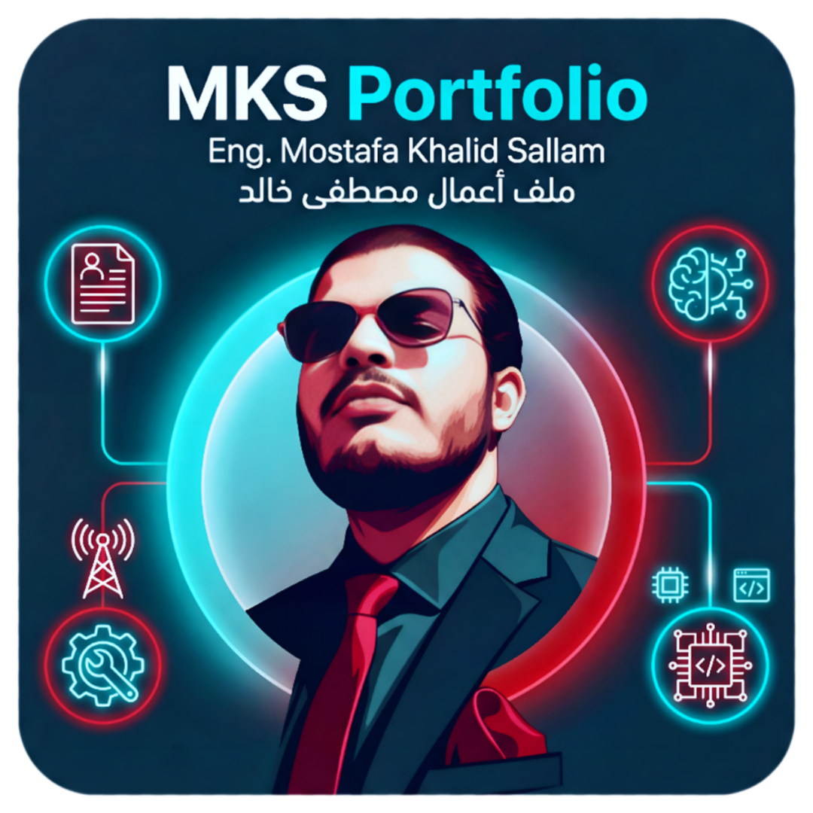

# 👨‍💻 MKS Portfolio | ملف أعمال مصطفى خالد
### Communications & Electronics Engineer | مهندس اتصالات وإلكترونيات
*Engineering Excellence & Knowledge Sharing*
*التميز الهندسي ونشر المعرفة*

[-blue.svg)]()

---

## 📖 Overview | نبذة عامة

**MKS Portfolio** is a professional, responsive web application designed to showcase the professional journey, technical expertise, and educational contributions of **Eng. Mostafa Khalid Sallam**. It can be installed as a desktop app via the browser.

**موقع ملف أعمال مصطفى خالد (MKS Portfolio)** هو تطبيق ويب احترافي ومتجاوب صُمم لعرض المسيرة المهنية، الخبرات التقنية، والمساهمات التعليمية **للمهندس مصطفى خالد سلام**. يمكن تثبيته كتطبيق على سطح المكتب عبر المتصفح.

---

## ⭐ Key Features | المميزات الرئيسية

### 🎨 1. Stunning Design | تصميم مذهل
- **Glassmorphism UI**: Modern glass-effect design with smooth animations.
    - *تصميم زجاجي عصري:* تصميم بتأثير الزجاج مع حركات سلسة.
- **Dark/Light Mode**: Toggle between themes with persistent preferences.
    - *الوضع الداكن/الفاتح:* التبديل بين السمات مع حفظ التفضيلات.
- **Neon Glow Effects**: Premium cyan neon accents in dark mode.
    - *تأثيرات نيون متوهجة:* لمسات نيون سماوية فاخرة في الوضع الداكن.
- **Smooth Animations**: AOS (Animate on Scroll) for engaging transitions.
    - *حركات سلسة:* انتقالات جذابة عند التمرير.

### 🌐 2. Bilingual Support | دعم ثنائي اللغة
- **Arabic & English**: Instant language switching with full RTL support.
    - *العربية والإنجليزية:* تبديل فوري للغة مع دعم كامل للاتجاه من اليمين لليسار.
- **Localized Content**: All sections translated for both languages.
    - *محتوى مترجم:* جميع الأقسام مترجمة لكلا اللغتين.

### 📱 3. Progressive Web App (PWA) | تطبيق ويب تقدمي
- **Installable**: Install as a desktop app via browser (More Tools > Apps > Install).
    - *قابل للتثبيت:* تثبيت كتطبيق سطح مكتب عبر المتصفح.
- **Offline Support**: Service worker caches content for offline access.
    - *دعم بدون إنترنت:* يحفظ المحتوى للوصول بدون اتصال.
- **Custom Icon**: Beautiful app icon displayed after installation.
    - *أيقونة مخصصة:* أيقونة تطبيق جميلة تظهر بعد التثبيت.

### 📄 4. Comprehensive Sections | أقسام شاملة
- **Home**: Hero section with profile image, name, and typing animation.
    - *الرئيسية:* قسم بطولي مع صورة الملف الشخصي والاسم وحركة الكتابة.
- **About**: Detailed biography and professional summary.
    - *عني:* سيرة ذاتية مفصلة وملخص مهني.
- **Work Experience**: Timeline of professional positions.
    - *خبرات العمل:* جدول زمني للمناصب المهنية.
- **Education**: Academic qualifications with degree links.
    - *التعليم:* المؤهلات الأكاديمية مع روابط الشهادات.
- **Projects**: Graduation project showcase with GitHub links.
    - *المشاريع:* عرض مشروع التخرج مع روابط GitHub.
- **Teaching & Coupons**: Udemy courses and exclusive discount coupons.
    - *التدريس والكوبونات:* دورات Udemy وكوبونات خصم حصرية.
- **Articles**: Searchable and filterable technical articles.
    - *المقالات:* مقالات تقنية قابلة للبحث والتصفية.
- **Skills**: Technical skills organized by category.
    - *المهارات:* مهارات تقنية منظمة حسب الفئة.
- **Training**: Professional training and certifications.
    - *التدريب:* التدريب المهني والشهادات.
- **Courses**: Detailed course and training information.
    - *الدورات:* معلومات مفصلة عن الدورات والتدريبات.
- **Certificates**: Honors and professional certificates.
    - *الشهادات:* التكريمات والشهادات المهنية.
- **Contact**: All social media and contact links.
    - *التواصل:* جميع روابط التواصل الاجتماعي ووسائل الاتصال.

### 🔍 5. Articles System | نظام المقالات
- **Search**: Search articles by title, tag, or keyword.
    - *بحث:* البحث في المقالات حسب العنوان أو الوسم أو الكلمة المفتاحية.
- **Filters**: Filter by category (Telecom, 5G, AI, Networks, etc.).
    - *فلاتر:* التصفية حسب الفئة (اتصالات، 5G، ذكاء اصطناعي، شبكات...).
- **Dynamic Loading**: Articles loaded from JSON for easy updates.
    - *تحميل ديناميكي:* المقالات تُحمل من ملف JSON لسهولة التحديث.

---

## 👨‍💼 About the Engineer | عن المهندس

**Eng. Mostafa Khalid Sallam** is a highly motivated Communications & Electronics Engineer with a GPA of **3.58/4.0 (Excellent)**. He bridges the gap between hardware, connectivity, and intelligent software.

**م. مصطفى خالد سلام** هو مهندس اتصالات وإلكترونيات متميز (معدل تراكمي 3.58/4.0). يسعى لسد الفجوة بين الأجهزة، الاتصالات، والبرمجيات الذكية.

### 🎓 Education | التعليم
- **Bachelor's Degree in Communication and Electronics Engineering**
    - *Valley Institute for Engineering & Technology (SVA) | 2019 - 2024*
    - *Grade: Excellent (3.58/4.0)*

### 🛠️ Core Skills | المهارات الأساسية
- **Telecommunications**: GSM, UMTS, LTE, 5G NR, RF Planning, Drive Testing.
- **Networking**: CCNA (Switching, Routing, Automation).
- **Development**: Flutter, Dart, Python, C++, MATLAB.
- **IoT & AI**: ESP32, Arduino, Firebase, HCIA-AI Certified.

---

## 📫 Connect with Me | تواصل معي

| Platform | Link |
| :---: | :---: |
| **LinkedIn** |  |
| **GitHub** |  |
| **Email** |  |
| **YouTube** |  |
| **WhatsApp** |  |

---

## 🎨 Design & Colors | التصميم والألوان

The application features a **Glassmorphism Design System** that auto-adapts to Light and Dark modes.
يتميز التطبيق **بنظام تصميم زجاجي (Glassmorphism)** يتكيف تلقائياً مع الوضع الفاتح والداكن.

### 🌓 Modes | الأوضاع
- **☀️ Light Mode**: Professional design with clean aesthetics. | *الوضع الفاتح: تصميم احترافي بجماليات نظيفة.*
- **🌙 Dark Mode**: Cyan Neon Glow effects. | *الوضع الداكن: تأثيرات إضاءة نيون سماوية.*

### 🎨 Color Palette | لوحة الألوان

| Color Name (اللون) | Hex Code | Preview | Usage (الاستخدام) |
| :--- | :---: | :---: | :--- |
| **Neon Cyan** | `#00D2D3` | 🔵 | **Primary Color (Dark)**, Glow Effects |
| **Dark Slate** | `#0F2027` | ⚫ | Dark Background (الخلفية الداكنة) |
| **Soft White** | `#F5F7FA` | ⚪ | Light Background (الخلفية الفاتحة) |
| **Glass Effect** | `rgba(255,255,255,0.1)` | 🌫️ | Cards Background (خلفية الكروت) |

---

## 🌍 Accessibility | سهولة الاستخدام

- **Bilingual (ثنائي اللغة)**: Fully translated interfaces for **Arabic & English**.
    - *واجهات مترجمة بالكامل للعربية والإنجليزية.*
- **Responsive Design (تصميم متجاوب)**: Works on desktop, tablet, and mobile.
    - *يعمل على الكمبيوتر والتابلت والموبايل.*
- **Installable PWA (تطبيق قابل للتثبيت)**: Install via browser for desktop experience.
    - *تثبيت عبر المتصفح لتجربة سطح المكتب.*

---

## 🚀 Installation | التثبيت

### Install as Desktop App | التثبيت كتطبيق سطح مكتب:
1. Open the website in Chrome or Edge | افتح الموقع في Chrome أو Edge
2. Click the three-dot menu (⋮) | اضغط على قائمة النقاط الثلاث
3. Go to **More Tools > Apps > Install as an app** | اذهب إلى **أدوات إضافية > تطبيقات > تثبيت كتطبيق**
4. Enjoy the app with its custom icon! | استمتع بالتطبيق مع أيقونته المخصصة!

---

**Designed & Developed by Eng. Mostafa Khalid Sallam**
*تم التصميم والتطوير بواسطة م. مصطفى خالد سلام*

*(c) 2026 MKS Portfolio*

