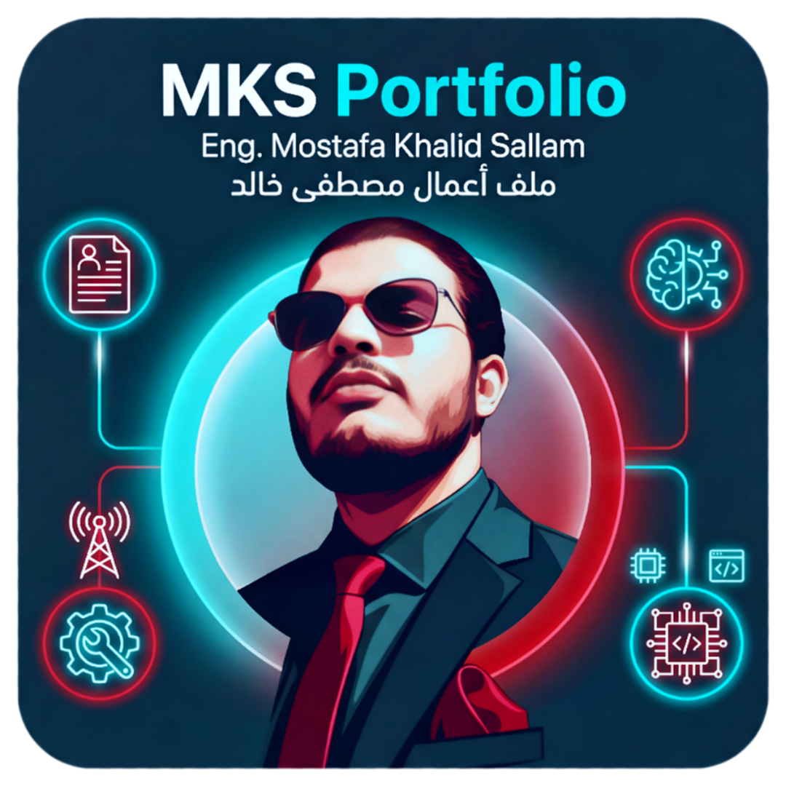

# 🌌 MKS Sci-Fi Portfolio | ملف أعمال مصطفى خالد
### Communications & Electronics Engineer | مهندس اتصالات وإلكترونيات
*Engineering Excellence & Futuristic Vision*
*التميز الهندسي والرؤية المستقبلية*

[-blue.svg)]()

---

## 📖 Overview | نبذة عامة

**MKS Sci-Fi Portfolio** is a cutting-edge, high-performance web application designed to showcase the professional journey of **Eng. Mostafa Khalid Sallam**. It features a state-of-the-art interactive 3D particle background, holographic UI components, and an immersive user experience, all while remaining fully installable as a Premium PWA.

**موقع ملف أعمال مصطفى خالد (MKS Sci-Fi Portfolio)** هو تطبيق ويب متطور وعالي الأداء صُمم لعرض المسيرة المهنية **للمهندس مصطفى خالد سلام**. يتميز بخلفية ثلاثية الأبعاد تفاعلية، ومكونات واجهة هولوغرافية، وتجربة مستخدم غامرة (Sci-Fi)، مع إمكانية تثبيته كتطبيق ويب متقدم (PWA).

---

## 🚀 What's New? (Premium Mobile & PWA Update) | التحديثات الجديدة

### 📱 1. Premium Mobile Navigation | قائمة تنقل احترافية للجوال
- **Liquid Menu Transition**: A full-screen, blurred glassmorphism menu with staggered link animations for a high-end mobile experience.
- **Swipe to Close**: Seamless gestures to close the menu, making navigation fluid and intuitive.
- *قائمة تنقل "سائلة" كاملة الشاشة بتأثيرات زجاجية وحركات متتابعة للروابط، مع دعم إيماءات السحب للإغلاق لتجربة جوال فائقة السلاسة.*

### 🔮 2. Holographic Touch-Glow | توهج هولوغرامي تفاعلي
- A subtle neon glow follows the user's touch on mobile screens, reinforcing the futuristic "Data Vault" theme.
- *توهج نيون خفيف يتبع لمسات إصبع المستخدم على شاشة الجوال، مما يعزز طابع "خزنة البيانات" العلمي والتقني.*

### ⚡ 3. PWA 2.0 & Smart Shortcuts | تطبيق ويب متقدم واختصارات ذكية
- **Advanced Manifest**: Optimized PWA settings with high-definition icons and splash screens.
- **App Shortcuts**: Quick access to Projects, Articles, and Contact directly from the home screen icon.
- *تحديث شامل لملف Manifest مع إضافة اختصارات سريعة للمشاريع والمقالات والتواصل مباشرة من أيقونة التطبيق.*

### 🛰️ 4. Cyber-Scan Header Animations | تحريك العناوين السيبراني
- All section titles now feature a dynamic "Cyber-Scan" light effect, making the interface feel alive and scanning for data.
- *تأثير "المسح السيبراني" المتحرك على جميع عناوين الأقسام، مما يعطي إحساساً بأن الواجهة حية وتقوم بمسح البيانات.*

---

## ⭐ Core Features | المميزات الأساسية

### 🎨 1. Cyberpunk Glassmorphism | تصميم زجاجي سيبراني
- **Dark Mode (Cyberpunk):** Deep space backgrounds with Neon Cyan and Magenta borders.
- **Light Mode (Deep Contrast):** Crisp dark text over bright glass cards for maximum readability.
- *تصميم زجاجي بألوان النيون السماوي والبنفسجي للوضع الداكن، مع تباين عالي وواضح جداً للوضع الفاتح.*

### 🌐 2. Bilingual Support | دعم ثنائي اللغة
- **Arabic & English**: Instant language switching with full RTL support.
- *العربية والإنجليزية: تبديل فوري للغة مع دعم كامل للاتجاه من اليمين لليسار.*

### 🛡️ 3. Privacy & Security Focused | التركيز على الخصوصية والأمان
- **Data Protection**: Built-in restrictions against unauthorized copying and source inspection.
- **Secure Data Vault**: All external files and links are handled within a secure holographic viewer.
- *حماية مدمجة للبيانات ضد النسخ غير المصرح به، مع فتح جميع الروابط الخارجية داخل مشغل هولوغرامي آمن.*

---

## 👨‍💼 About the Engineer | عن المهندس

**Eng. Mostafa Khalid Sallam** is a highly motivated Communications & Electronics Engineer with a GPA of **3.58/4.0 (Excellent)**. He bridges the gap between hardware, connectivity, and intelligent software.

**م. مصطفى خالد سلام** هو مهندس اتصالات وإلكترونيات متميز (معدل تراكمي 3.58/4.0). يسعى لسد الفجوة بين الأجهزة، الاتصالات، والبرمجيات الذكية.

### 🛠️ Core Skills | المهارات الأساسية
- **Telecommunications**: GSM, UMTS, LTE, 5G NR, RF Planning.
- **Networking**: CCNA (Switching, Routing).
- **Development**: Flutter, Dart, Python, C++, HTML/CSS/JS.
- **IoT & AI**: ESP32, Arduino, HCIA-AI Certified.
- **Teaching**: Courses Instructor on Udemy.

---

## 🎨 Design & Colors | التصميم والألوان (Sci-Fi Palette)

| Color Name (اللون) | Hex Code | Preview | Usage (الاستخدام) |
| :--- | :---: | :---: | :--- |
| **Neon Cyan** | `#00ffff` | 🩵 | Primary Accents, Glows, Buttons (الأساسي والنيون) |
| **Neon Magenta** | `#ff00ff` | 🩷 | Secondary Accents, Hover Effects (تأثيرات المرور) |
| **Deep Space Blue** | `#02040f` | 🌌 | Dark Mode Background (خلفية الوضع الداكن) |
| **Soft Light Glass**| `#E6E9F0` | ☁️ | Light Mode Background (خلفية الوضع الفاتح) |
| **Holographic Glass**| `rgba(10, 14, 39, 0.7)` | 🧊 | Dark Glass Cards (الكروت الزجاجية الداكنة) |

---

## 🚀 Installation | التثبيت

### Install as Desktop/Mobile App | التثبيت كتطبيق:
1. Open the website in your browser | افتح الموقع في متصفحك
2. For Mobile: Use "Add to Home Screen" | للجوال: اختر "إضافة إلى الشاشة الرئيسية"
3. For Desktop: Click "Install App" in the address bar | للكمبيوتر: اضغط على "تثبيت التطبيق" في شريط العنوان
4. Enjoy a seamless, standalone experience! | استمتع بتجربة تطبيق مستقلة وسلسة!

---

**Designed & Developed by Eng. Mostafa Khalid Sallam**
*تم التصميم والتطوير بواسطة م. مصطفى خالد سلام*

*(c) 2026 MKS Sci-Fi Portfolio*

