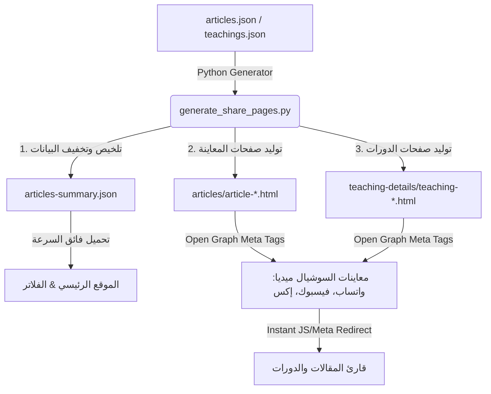

<div align="center">


# 🌌 MKS Sci-Fi Portfolio & Engineering Knowledge Hub
## 🚀 ملف أعمال ومنصة المعرفة الهندسية | م. مصطفى خالد سلام
### *Communications & Electronics Engineer | مهندس اتصالات وإلكترونيات*

<p align="center">
  <strong>🌟 Engineering Excellence • Futuristic Vision • Smart Sharing Ecosystem • Ultra-Smooth Mobile 🌟</strong>
</p>

<!-- Badges Row 1: Core Tech & Status -->
[](https://mostafa-khalid208.github.io/Test/)
[]()
[](generate_share_pages.py)
[]()
[]()
[](LICENSE)

<!-- Badges Row 2: Features & Technologies -->
[]()
[]()
[]()
[]()
[]()
[]()
[]()

<br>

[🌐 **زيارة الموقع المباشر / Live Demo**](https://mostafa-khalid208.github.io/Test/) • [📚 **تصفح المقالات / Articles**](https://mostafa-khalid208.github.io/Test/article.html) • [🎓 **الدورات والكوبونات / Teachings**](https://mostafa-khalid208.github.io/Test/teachings.html)

---

</div>

## 📑 فهرس المحتويات | Table of Contents
- [🌟 نبذة عامة | Overview](#-نبذة-عامة--overview)
- [📱 منظومة تجربة الهاتف والسلاسة الفائقة | Ultra-Smooth Mobile Engine](#-منظومة-تجربة-الهاتف-والسلاسة-الفائقة--ultra-smooth-mobile-engine)
- [🔥 التحديثات الجديدة الشاملة | Latest Major Updates](#-التحديثات-الجديدة-الشاملة--latest-major-updates)
  - [1️⃣ شريط التنقل العائم والتنقل الحر (Floating Quick Dock)](#1-شريط-التنقل-العائم-والتنقل-الحر-floating-quick-dock)
  - [2️⃣ منظومة النسخ والمشاركة الذكية (Smart Copy & Rich Sharing)](#2-منظومة-النسخ-والمشاركة-الذكية-smart-copy--rich-sharing)
  - [3️⃣ عارض الوسائط والصور المتقدم (Image & Media Engine)](#3-عارض-الوسائط-والصور-المتقدم-image--media-engine)
  - [4️⃣ صفحات التفاصيل والروابط التفاعلية (Details & Dynamic Routing)](#4-صفحات-التفاصيل-والروابط-التفاعلية-details--dynamic-routing)
  - [5️⃣ محرك بايثون وتوليد المعاينات (Python Automation Engine)](#5-محرك-بايثون-وتوليد-المعاينات-python-automation-engine)
  - [6️⃣ منصة المقالات الهندسية (Articles Architecture)](#6-منصة-المقالات-الهندسية-articles-architecture)
  - [7️⃣ منصة الدورات والكوبونات (Teachings & Coupons Hub)](#7-منصة-الدورات-والكوبونات-teachings--coupons-hub)
- [🎨 لوحة الألوان والتصميم السيبراني | Sci-Fi Palette & Design](#-لوحة-الألوان-والتصميم-السيبراني--sci-fi-palette--design)
- [🛠️ البنية التقنية للمشروع | Tech Stack & Architecture](#️-البنية-التقنية-للمشروع--tech-stack--architecture)
- [📱 تطبيق الويب التقدمي | PWA 2.0 Features](#-تطبيق-الويب-التقدمي--pwa-20-features)
- [🚀 تشغيل وتوليد الصفحات | How to Run & Generate](#-تشغيل-وتوليد-الصفحات--how-to-run--generate)
- [👨‍💼 عن المهندس | About the Engineer](#-عن-المهندس--about-the-engineer)

---

## 🌟 نبذة عامة | Overview

<div align="center">
  <table>
    <tr>
      <td width="50%">
        <h3 align="center">🇸🇦 باللغة العربية</h3>
        <p><strong>MKS Sci-Fi Portfolio</strong> هو منصة وتطبيق ويب مستقبلي متكامل يجمع بين استعراض المسيرة المهنية للمهندس <strong>مصطفى خالد سلام</strong> ومكتبة هندسية ضخمة للمقالات المتخصصة والدورات والكوبونات التدريبية. تم تزويد الموقع بمحرك تجاوب فائق الذكاء للهواتف الذكية مع شريط تنقل عائم، وقائمة سائلة كاملة الارتفاع، وسلاسة حركية 120fps بدون أي تقطيع أو انزلاق أفقي.</p>
      </td>
      <td width="50%">
        <h3 align="center">🇬🇧 In English</h3>
        <p><strong>MKS Sci-Fi Portfolio</strong> is an advanced futuristic web application and knowledge hub showcasing the engineering journey of <strong>Eng. Mostafa Khalid Sallam</strong> alongside a rich library of specialized engineering articles, courses, and educational coupons. Re-engineered with an ultra-responsive mobile architecture, floating quick-dock, 120fps physics, gesture controls, and zero horizontal overflow across all screen sizes.</p>
      </td>
    </tr>
  </table>
</div>

---

## 📱 منظومة تجربة الهاتف والسلاسة الفائقة | Ultra-Smooth Mobile Engine

```
╔════════════════════════════════════════════════════════════════════════════════════════╗
║                   📱 MOBILE-FIRST ADAPTIVE & ULTRA-FLUID ARCHITECTURE                  ║
╠════════════════════════════════════════════════════════════════════════════════════════╣
║  🛸 Floating Quick Dock        ║  🧭 One-Thumb Fast Navigation                        ║
║  🌀 100dvh Liquid Drawer Menu  ║  👆 Multi-Directional Swipe Gestures (Up/Left/Right) ║
║  🔝 Circular Progress Ring Top ║  🛹 Touch-Swipe Horizontal Filter Carousel           ║
║  📐 Dynamic Fluid clamp() Tech ║  ⚡ 60-120fps GPU Hardware Acceleration             ║
║  🛡️ Safe Area Insets (iOS/And) ║  📱 100% Adaptability (280px to Foldables/Tablets)    ║
╚════════════════════════════════════════════════════════════════════════════════════════╝
```

### 🌟 أبرز مميزات تجربة الهاتف الذكي (Mobile Innovations):

1. **🛸 شريط التنقل السريع العائم الذكي (Floating Mobile Quick Dock):**
   - شريط زجاجي سيبراني عائم ومثبت أسفل شاشة الهاتف بتأثير Glassmorphism نيون.
   - يتيح التنقل الحر والفوري بإصبع الإبهام (One-Thumb Navigation) بين:
     - 🏠 **الرئيسية (Home)**
     - 💼 **المشاريع والخبرات (Projects)**
     - 📰 **المقالات الهندسية (Articles)**
     - 🎓 **الدورات والكوبونات (Teachings)**
     - ☰ **القائمة الكاملة (Full Menu)**
   - يدعم المزامنة اللحظية (Live Active State Sync) مع القسم المعروض حالياً ونقطة نيون مضيئة تفاعلية.

2. **🌀 القائمة السائلة التفاعلية (100dvh Liquid Glass Drawer):**
   - تغطية كاملة ودقيقة للشاشة بارتفاع ديناميكي `100dvh` (Dynamic Viewport Height) لمنع أي تشوه عند ظهور أو اختفاء شريط المتصفح.
   - ترويسة أنيقة بشعار الموقع وزر إغلاق صريح وبارز `(✕)`.
   - كروت تنقل شبكية منظمة ومزودة بأيقونات وتأثيرات ظهور تتابعية متدرجة (Staggered Animations).
   - قفل تلقائي لتمرير الصفحة خلف القائمة لمنع التداخل.

3. **👆 إيماءات اللمس الذكية متعددة الاتجاهات (Multi-Directional Gestures):**
   - إمكانية إغلاق القائمة بالسحب السريع للأعلى أو لليمين/اليسار بسلاسة تامة.
   - إزالة تأخير النقر (300ms Tap Delay) عبر خاصية `touch-action: manipulation`.
   - استجابة فيزيائية لمسية فورية (Tactile Active Press Effect) لجميع الأزرار والكروت.

4. **🔝 زر الصعود الذكي مع مؤشر القراءة الدائري (Scroll-To-Top Circular Progress):**
   - زر عائم دائري يظهر تلقائياً عند التمرير لأسفل.
   - حلقة SVG دائرية متوهجة تحسب نسبة قراءة وتصفح الصفحة بدقة متناهية وترتفع مع التمرير.
   - صعود انسيابي سلس وفوري لأعلى الصفحة بنقرة واحدة.

5. **🛹 شريط الفلاتر الأفقي الانسيابي (Touch-Swipe Filter Carousel):**
   - تحويل فلاتر المقالات والدورات على الهاتف إلى شريط كبسولات أفقي قابل للتمرير بالسحب والانزلاق باللمس (`-webkit-overflow-scrolling: touch`).
   - استقرار سلس ومحاذاة تلقائية (Scroll Snap) للكبسولة النشطة دون تشويه واجهة المستخدم.

6. **📐 تكيف مطلق مع جميع مقاسات الشاشات (280px إلى Foldables و Tablets):**
   - طباعة خطوط مرنة وحيوية باستخدام دالة `clamp()` الرياضية لجميع العناوين والنصوص.
   - كروت شبكية ذكية `minmax(min(100%, 280px), 1fr)` تضمن عدم خروج أي كارت عن حدود الشاشة إطلاقاً مع انعدام تام لأي تمرير أفقي جانبي عرضي.
   - احترام حواف الشاشات الآمنة للهواتف الحديثة والـ Dynamic Island والنوتش (`env(safe-area-inset-*)`).

7. **⚡ تسريع المعالجة الرسومية وثبات الإطارات (60-120fps Smoothness):**
   - استخدام `transform: translate3d(0,0,0)` و `will-change` لتفعيل تسريع العتاد (GPU Acceleration).
   - تخفيف حسابات جزيئات Three.js ثلاثية الأبعاد بذكاء على الهواتف لتوفير البطارية وضمان أعلى معدل إطارات سلس.

---

## 🔥 التحديثات الجديدة الشاملة | Latest Major Updates

### 1️⃣ شريط التنقل العائم والتنقل الحر (Floating Quick Dock)
* شريط تنقل سفلي عائم بلمسات نيون مستقبلية يتيح الوصول المباشر لكافة أركان الموقع دون الحاجة للتمرير لأعلى الصفحة.
* تأثيرات تفاعلية استثنائية مع دعم التبديل الفوري بين اللغتين العربية والإنجليزية.

---

### 2️⃣ منظومة النسخ والمشاركة الذكية (Smart Copy & Rich Sharing)
* **📋 إشعار النسخ الغني (Rich Share Preview Toast):**
  * عند النقر على زر النسخ أو المشاركة في أي مقال أو دورة، يتم فوراً نسخ الرابط إلى الحافظة، مع ظهور **Toast تفاعلي فاخر** أسفل الشاشة يحتوي على:
    * صورة مصغرة للمحتوى (Image Thumbnail)
    * عنوان المقال/الدورة والملخص (Title & Summary)
    * زر فتح الرابط مباشرة وزر مشاركة أصلي.
* **⚡ دعم Web Share API الأصلي:**
  * مشاركة سلسة وتلقائية مع تطبيقات الهواتف الذكية (WhatsApp, Telegram, Facebook, Twitter/X, LinkedIn) بضغطة زر واحدة.
* **🎟️ نسخ أكواد الكوبونات:**
  * إمكانية نسخ كود الخصم (Coupon Code) بنقرة واحدة مع توضيح مدة الصلاحية والمقاعد المتاحة.

---

### 3️⃣ عارض الوسائط والصور المتقدم (Image & Media Engine)
* **🖼️ نظام إدارة الصور الذكي والبدائل الفاخرة (Fallback Images):**
  * معالجة تلقائية لأي رابط صورة غير متاح أو تالف عبر بدائل صور ذهبية وسماوية فائقة الجودة (`FALLBACK_ARTICLE_IMAGE` & `FALLBACK_TEACHING_IMAGE`).
  * تحسين تحميل الصور بتنسيق الكروت والـ Lazy Loading لتسريع استجابة الصفحة.
* **🎥 مشغلات الفيديو التفاعلية المدمجة (Smart Auto-Embedder):**
  * تحويل الروابط تلقائياً داخل نصوص المقالات والدورات إلى مشغلات تفاعلية مباشرة تشمل:
    * 🔴 **YouTube** (الفيديوهات العادية ومقاطع Shorts)
    * ⚫ **TikTok** (مشغل التيك توك المباشر)
    * 🟣 **Instagram** (المنشورات والـ Reels)
    * 🔵 **Facebook Videos & Watch**
    * 🐦 **Twitter / X** Tweets
    * 🧵 **Threads** Posts
    * 🎬 **Vimeo** Player
    * 🎓 **Udemy Course Preview Cards**
* **📐 المعادلات الرياضية والرموز العلمية (MathJax):**
  * دعم كامل لتصيير المعادلات والرموز الهندسية والفيزيائية بتنسيق LaTeX بدقة عالية داخل المقالات.

---

### 4️⃣ صفحات التفاصيل والروابط التفاعلية (Details & Dynamic Routing)
* **📄 قارئ المقالات المخصص (`articles/?id=...`):**
  * صفحة مخصصة لقراءة المقال بالكامل مع عداد التاريخ، الوسوم (Hashtags)، التصنيف، أزرار الطباعة، والمشاركة.
  * دعم كامل للتنقل الفوري وتغيير اللغة (عربي / إنجليزي) والوضع المظلم دون إعادة تحميل الصفحة.
* **🎓 صفحة تفاصيل الدورات والندوات (`teaching-details/?id=...`):**
  * استعراض تفاصيل المحاضرات، المدة الزمنية، تقييمات الطلاب، الأسعار، وأكواد الخصم التفاعلية.
* **🛡️ عارض البيانات الهولوغرافي الآمن (Holographic Data Vault):**
  * استعراض ملفات السيرة الذاتية (CV)، الشهادات، وملفات Google Drive داخل نافذة عائمة ثلاثية الأبعاد بتأثير زجاجي دون مغادرة الموقع.

---

### 5️⃣ محرك بايثون وتوليد المعاينات (Python Automation Engine)
ملف الأتمتة الرئيسي: [`generate_share_pages.py`](generate_share_pages.py)


```mermaid
graph TD
    A[articles.json / teachings.json] -->|Python Generator| B(generate_share_pages.py)
    B -->|1. تلخيص وتخفيف البيانات| C[articles-summary.json]
    B -->|2. توليد صفحات المعاينة| D[articles/article-*.html]
    B -->|3. توليد صفحات الدورات| E[teaching-details/teaching-*.html]
    C -->|تحميل فائق السرعة| F[الموقع الرئيسي & الفلاتر]
    D & E -->|Open Graph Meta Tags| G[معاينات السوشيال ميديا: واتساب، فيسبوك، إكس]
    G -->|Instant JS/Meta Redirect| H[قارئ المقالات والدورات]
```

* **⚡ تقليص حجم البيانات بنسبة > 90%:**
  * إنشاء ملف `articles-summary.json` الخفيف لتغذية شبكة الكروت في الصفحة الرئيسية والبحث بسرعة هائلة وتوفير الباندويث.
* **🌐 صفحات مشاركة ثابتة ببطاقات Open Graph كاملة:**
  * توليد ملف HTML مستقل لكل مقال (`articles/article-{id}.html`) وكل دورة (`teaching-details/teaching-{id}.html`).
  * تزويد كل صفحة بوسوم `og:image`, `og:title`, `og:description`, `twitter:card`, وبيانات `Schema.org Article JSON-LD`.
  * تحويل فوري تلقائي للزائر (Instant Redirect) لقارئ المقال الفعلي لتجربة تصفح متكاملة.

---

### 6️⃣ منصة المقالات الهندسية (Articles Architecture)
* **📚 مكتبة مقالات شاملة** تغطي أحدث فروع الهندسة والتقنية:
  * 📡 **الاتصالات**: GSM, 3G, 4G LTE, 5G NR, 6G Future, RF Planning, Optical Comm, Satellites.
  * 💻 **البرمجة والأنظمة**: Python, C++, Flutter, Web Dev, Embedded Systems, Linux.
  * 🤖 **الذكاء الاصطناعي**: AI, Machine Learning, Deep Learning, Computer Vision.
  * 🔒 **الأمن السيبراني**: Cyber Security, Network Protection, Protocols.
  * 🌌 **العلوم العامة والفضاء**: Astronomy, Physics, History & Technology Insights.
* **🔍 بحث حي ومباشر (Debounced Live Search):**
  * بحث فوري بالعنوان، الملخص، أو الوسوم (#tags) باللغتين العربية والإنجليزية.
* **📑 تصفح وتقسيم ذكي (Dynamic Pagination):**
  * نظام "عرض المزيد" (Load More) لتقسيم المقالات بسلاسة ومنع بطء المتصفح.

---

### 7️⃣ منصة الدورات والكوبونات (Teachings & Coupons Hub)
* **🎓 تصنيف متعدد الأبعاد:**
  * تبويبات رئيسية: **الكل | الدورات | الندوات وورش العمل | الكوبونات**.
  * فلاتر المنصات: **Udemy | YouTube | ورش العمل المباشرة**.
* **🎟️ قسم الكوبونات التفاعلي:**
  * تمييز الكوبونات المجانية (Free 100% OFF) وكوبونات الخصم مع بيان تاريخ الانتهاء.

---

## 🎨 لوحة الألوان والتصميم السيبراني | Sci-Fi Palette & Design

| Color (اللون) | Hex Code | Swatch | Usage (الاستخدام في الموقع) |
| :--- | :---: | :---: | :--- |
| **Neon Cyan** | `#00ffff` |  | الأزرار الرئيسية، حدود النيون، التوهج السيبراني، شريط التنقل السفلي |
| **Imperial Gold** | `#d4af37` |  | تمييز المقالات الفاخرة، بطاقات المعاينة، الشارات |
| **Neon Magenta** | `#ff00ff` |  | تأثيرات الـ Hover، التدرجات الجمالية، الخطوط الثانوية |
| **Emerald Green** | `#10b981` |  | إشعارات النجاح، شارات الكوبونات المجانية واللغات |
| **Deep Space** | `#02040f` |  | خلفية الوضع الداكن السيبراني فائق العمق |
| **Dark Glass** | `rgba(10, 14, 39, 0.75)` |  | الكروت الزجاجية الشفافة (Glassmorphism Cards) |

---

## 🛠️ البنية التقنية للمشروع | Tech Stack & Architecture

```
My-CV-Communications-Electronics-Engineer/
├── 📄 index.html                     # الصفحة الرئيسية وملف الأعمال والـ Hero 3D والشريط العائم
├── 📄 article.html                   # قارئ المقالات المستقل
├── 📄 teachings.html                 # منصة الدورات والكوبونات
├── 📄 teaching-details.html          # قارئ تفاصيل الدورة أو الكوبون
├── 📄 404.html                       # صفحة الخطأ التفاعلية المخصصة
├── 📜 styles.css                     # التنسيقات الرئيسية، محرك الجوال 120fps وتأثيرات الزجاج
├── 📜 teachings-style.css            # تنسيقات شبكة الدورات والكوبونات المتجاوبة
├── ⚡ scripts.js                     # محرك الجزيئات 3D، إيماءات اللمس، الشريط العائم، واللغات
├── ⚡ articles-manager.js            # إدارة شبكة المقالات والبحث والترقيم السريع
├── ⚡ article-details.js             # تصيير المقال والوسائط ومعادلات MathJax
├── ⚡ teachings-manager.js           # إدارة الدورات، الفلاتر الأفقية، والكوبونات
├── ⚡ teaching-details.js            # تصيير تفاصيل الدورة والمشاركة
├── 🐍 generate_share_pages.py        # أتمتة بايثون لتوليد بطاقات السوشيال والتلخيص
├── 📊 articles.json                  # قاعدة بيانات المقالات الكاملة
├── 📊 articles-summary.json          # قاعدة بيانات المقالات الملخصة (سريعة جداً)
├── 📊 teachings.json                 # قاعدة بيانات الدورات والكوبونات
├── 📁 articles/                      # صفحات Open Graph المولدة للمقالات (article-*.html)
├── 📁 teaching-details/              # صفحات Open Graph المولدة للدورات (teaching-*.html)
├── 📱 manifest.json                  # إعدادات تطبيق الويب PWA 2.0
└── ⚙️ service-worker.js              # التخزين المؤقت والعمل بدون إنترنت
```

---

## 📱 تطبيق الويب التقدمي | PWA 2.0 Features

* **📲 التثبيت الفوري:** تثبيت بنقرة واحدة كتطبيق أصلي على أنظمة Windows, macOS, Android, و iOS.
* **⚡ اختصارات التطبيق (App Shortcuts):**
  * الوصول السريع المباشر من الشاشة الرئيسية للمقالات، الدورات، والتواصل.
* **📴 التشغيل دون اتصال (Offline Support):**
  * دعم التخزين المؤقت عبر `service-worker.js` لتصفح الصفحات الأساسية بدون إنترنت.

---

## 🚀 تشغيل وتوليد الصفحات | How to Run & Generate

### 1. تشغيل الموقع محلياً:
يمكنك فتح `index.html` مباشرة أو تشغيل سيرفر محلي خفيف:
```bash
# باستخدام بايثون
python -m http.server 8000
```
ثم توجه إلى المتصفح عبر الرابط: `http://localhost:8000`

### 2. تحديث وتوليد صفحات المشاركة والملخصات:
عند إضافة مقالات جديدة في `articles.json` أو دورات جديدة في `teachings.json`، قم بتشغيل اسكربت بايثون:
```bash
python generate_share_pages.py
```
**المخرجات الناتجة تلقائياً:**
- ✅ تحديث `articles-summary.json` فائق السرعة.
- ✅ توليد جميع صفحات `articles/article-{id}.html` لشبكات التواصل.
- ✅ توليد جميع صفحات `teaching-details/teaching-{id}.html` للكوبونات والدورات.

---

## 👨‍💼 عن المهندس | About the Engineer

<div align="center">

### **م. مصطفى خالد سلام**
### **Eng. Mostafa Khalid Sallam**
*Communications & Electronics Engineer | GPA: 3.58 / 4.0 (Excellent)*

[](https://linkedin.com/in/mostafa-khalid-sallam)
[](https://udemy.com)
[](https://github.com/mostafa-khalid208)
[](https://t.me/)

</div>

---

<div align="center">

<sub>Designed with Futuristic Precision & Engineered for 120fps Mobile Performance</sub>  
**© 2026 Eng. Mostafa Khalid Sallam — MKS Sci-Fi Portfolio. All Rights Reserved.**

</div>
